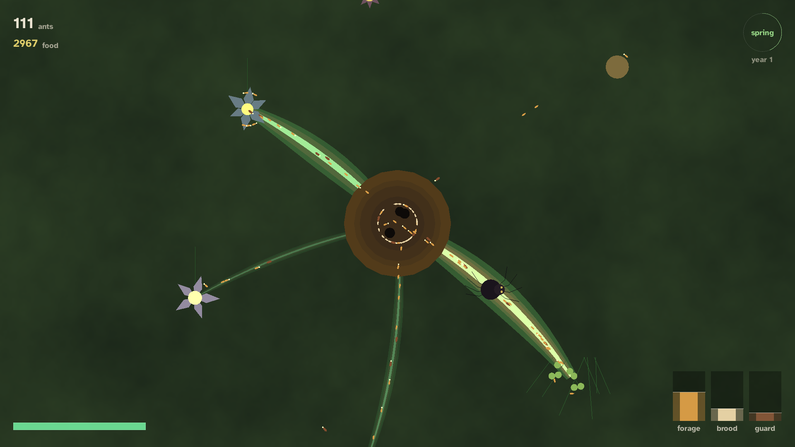
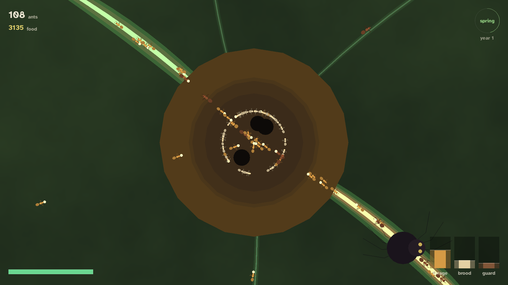
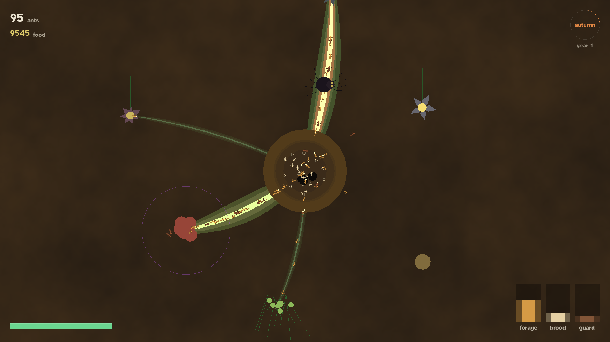
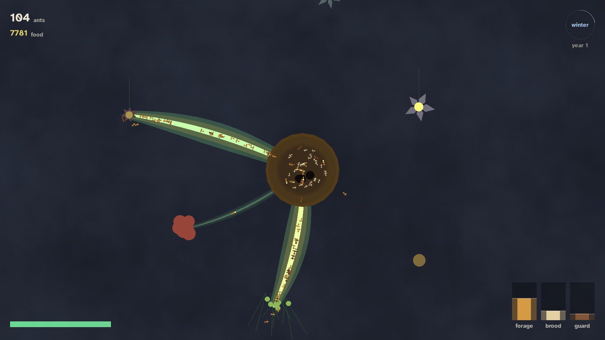

# Formix

A chill 4X you tend from the couch: send ants, take ground, grow an engine.

You start with a handful of ants spread across a few mounds and not enough
on any one of them to do anything. You drag them together, ten of them
raise a queen, and she starts laying. From there the colony pays for
itself: each mound you take and settle produces the ants that take the
next one.



*Every screenshot here is the real game running.*

## What you do

One verb: **send**. Pick a mound you hold, drag to somewhere else, and its
ants walk there. Everything else is a modifier on that.

| | |
|---|---|
| **Send** | Touch: drag between two mounds; how far you drag sets how many go. Pad: A to pick up, a direction to aim, A to send. |
| **Take** | Enough arrivals colonise empty ground. Held ground has to be fought for. |
| **Queen** | Ten ants raise one. She lays larvae, they hatch, and that mound starts paying for the next. |
| **Brood** | Twenty ants speed up a queen's laying. Twice per mound, so no single super-hill. |
| **Feed** | A queen eats to lay: one food, one worker. Food is carried home from aphids, grain and the odd spider. |

## Moving the view

| | pan | zoom |
|---|---|---|
| **touch** | drag anywhere that is not a mound | pinch |
| **mouse** | drag empty ground | scroll wheel |
| **pad** | right stick | shoulders (L/R); R3 resets |

A drag that starts ON a mound is always a send, never a pan, and a second
finger landing mid-drag cancels that send rather than completing it -- an
irreversible move should never be one stray touch away. On the pad the
shoulders trim the send quantity while an order is being composed and step
the zoom the rest of the time; the gauge on screen says which.

A tap only selects. Sending is always a deliberate drag, because an
irreversible move should never be one stray tap away.

## Fog is presence

There is no dark sheet over the map. You can always see the *shape* of the
field — where the mounds are — but a mound you have never stood on is grey
stone and tells you nothing:

- no owner colour on its rim
- no garrison count, no queens, no larvae
- not even its kind, so you cannot tell rich ground from poor

Walk in and it warms to earth and gives up its secrets. That is the whole
of the fog, and it is why scouting is a real move rather than a formality.



## The campaign

Four hand-built missions, each arranged so its one lesson is the obvious
thing to try. A mission is finished by *doing* the thing it teaches, and
there is no way to fail one.

1. **Gather** — no mound has ten ants, but the board does. Pull them
   together and raise your first queen.
2. **Settle** — ten ants and one queen. Finish with four mounds, each with
   a queen of its own. Ten buys exactly one queen, so spending it all at
   the start leaves nothing to expand with.
3. **Neighbours** — a red colony in the corner, quiet until you find it.
   The map opens exactly like Settle until your frontier touches theirs.
4. **War** — two rival colonies, both awake, both expanding into the
   middle. They fight each other as well as you.

Then the open field: the generated map with everything live at once.

## Everything is generated

There is not a single bitmap in the game. Ants are three segments with six
legs walking in an alternating tripod, and their detail tiers by zoom so a
colony reads as a stream from across a room and as individuals up close.
Every mound's shape comes from its own seed, so no two look alike and the
look is reproducible from a save.

 

## Running it

The game is a [wasmcart](https://github.com/monteslu/wasmcart) cart: one
file that runs on a desktop, in a browser, or on Android.

```sh
./build.sh          # produces formix.wasc
```

`build.sh` finds the engine and packer through `WASMCART_LUA`, `ENGINE` and
`WASMCART_PACK`, and contains no absolute paths.

For Android, point the wasmcart Android build at the cart:

```sh
WC_ENGINE_REPO=<wasmcart-lua> ./build-game-apk.sh formix.wasc icon.png
```

## Contributing

[docs/ARCHITECTURE.md](docs/ARCHITECTURE.md) explains the four layers and
the rule between them: the simulation never draws, the renderer never
decides. Read that first.

[docs/ENGINE-NOTES.md](docs/ENGINE-NOTES.md) is the list of things that
cost real time to discover — blend modes that do not composite, integer
uniforms that arrive as zero, canvases that cannot be read back. Worth
skimming before debugging anything that looks impossible.

The test suite drives the actual game:

```sh
node tools/run-tests.mjs
```

It needs the [romdev](https://www.npmjs.com/package/romdevtools) MCP server
running, which is where screenshots, cart logs and input scripting live.
Gates assert on what the simulation reports or what the pixels show, never
on a claim — and they are written so that breaking the thing they test
makes them fail. Several were rewritten after they passed a deliberately
sabotaged build.

## Licence

[MIT](LICENSE). All code, art and audio in this repository is original.
The typeface is [Atkinson
Hyperlegible](https://www.brailleinstitute.org/freefont) (SIL Open Font
License), chosen because it was designed for low-vision readability, which
is the same problem as being read from a couch.
